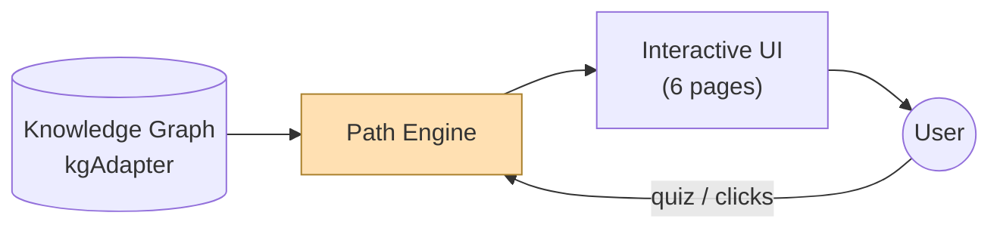
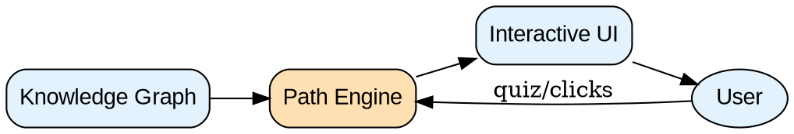

# 论文图表制作手册

EMNLP demo 论文通常需要 3 类图。本手册给出每类的**推荐工具 + 可直接跑的代码模板**。
原则：能矢量就矢量（TikZ/PDF/SVG），投稿图清晰、可放大不糊。

| 图类型 | 出现位置 | 推荐工具 | 备选 |
|--------|---------|---------|------|
| 系统架构图 / 流程图（Figure 1）| System 节 | TikZ（投稿终稿）| Mermaid / Graphviz（快速起草）|
| 界面截图 / 使用示例 | Usage 节 | 跑 demo 浏览器截图 | — |
| 数据图表（评估结果）| Evaluation 节 | matplotlib | — |

> 工作流建议：起草阶段先用 Mermaid 快速画结构（几秒出图、易改），定稿前再转成 TikZ 嵌入 LaTeX。

---

## 1. 系统架构图 —— TikZ（投稿终稿，矢量）

直接放进 `.tex`，编译即矢量图。下面是「数据层→处理→前端」三层架构的可改模板：

```latex
\usepackage{tikz}
\usetikzlibrary{arrows.meta, positioning, fit, backgrounds}

\begin{figure}[t]
\centering
\begin{tikzpicture}[
  node distance=8mm and 12mm,
  box/.style={draw, rounded corners, align=center, font=\small,
              minimum height=8mm, minimum width=22mm, fill=blue!8},
  core/.style={box, fill=orange!15},
  arr/.style={-{Stealth[length=2mm]}, thick}]

  \node[box] (kg) {Knowledge Graph\\(kgAdapter)};
  \node[core, right=of kg] (engine) {Path Engine};
  \node[box, right=of engine] (ui) {Interactive UI\\(6 pages)};
  \node[box, below=of engine] (user) {User};

  \draw[arr] (kg) -- (engine);
  \draw[arr] (engine) -- (ui);
  \draw[arr] (ui) -- (user);
  \draw[arr] (user) -- (engine) node[midway, right, font=\scriptsize]{quiz / clicks};
\end{tikzpicture}
\caption{Overall architecture of \textsc{SystemName}.}
\label{fig:arch}
\end{figure}
```

要点：用 `\textsc{}` 写系统名；节点用语义色（核心模块高亮色）；箭头标注数据流；`[t]` 置顶。

---

## 2. 系统架构图 —— Mermaid（快速起草）

适合先把结构理清。写成 `.mmd` 文件，用 `mmdc`（mermaid-cli）导出 PNG/SVG/PDF：



导出命令（需 `npm i -g @mermaid-js/mermaid-cli`）：
```bash
mmdc -i arch.mmd -o arch.pdf      # PDF 矢量，可直接 \includegraphics
mmdc -i arch.mmd -o arch.png -s 3 # 高分辨率 PNG
```

---

## 3. 系统架构图 —— Graphviz（备选，适合复杂图谱）

节点多、关系密时（如知识图谱本身）用 Graphviz 自动布局。写 `.dot`：


```bash
dot -Tpdf arch.dot -o arch.pdf    # 或 -Tpng -Gdpi=300
```

---

## 4. 数据图表 —— matplotlib（评估结果）

Python 生成，存为 PDF 矢量。下面是评估结果柱状图模板（如 SUS/准确率对比）：

```python
import matplotlib.pyplot as plt
plt.rcParams.update({'font.size': 11, 'font.family': 'DejaVu Sans',
                     'pdf.fonttype': 42})  # 42=可编辑字体，期刊要求

methods = ['Baseline', 'Ours']
scores  = [62, 81]            # 例：SUS 分数
fig, ax = plt.subplots(figsize=(3.2, 2.4))  # 单栏宽约 3.2 inch
bars = ax.bar(methods, scores, color=['#bdbdbd', '#1f6d54'], width=0.55)
ax.set_ylabel('SUS Score'); ax.set_ylim(0, 100)
ax.axhline(68, ls='--', c='gray', lw=1)      # SUS 平均线
for b, s in zip(bars, scores):
    ax.text(b.get_x()+b.get_width()/2, s+2, str(s), ha='center', fontsize=10)
plt.tight_layout()
plt.savefig('eval.pdf', bbox_inches='tight')  # 矢量，嵌入 LaTeX
```

要点：`figsize` 按单栏（~3.2in）或双栏（~6.6in）；存 PDF 而非 PNG；`pdf.fonttype=42` 让字体可被出版系统识别。

---

## 5. 界面截图 —— 跑 demo 截图（Usage 节）

TCM demo 在本地可跑，截图流程：
1. `npm run dev` 启动；
2. 浏览器开 F12 切手机视图（demo 按 560px 移动端设计），逐页截图；
3. 关键页：测试题、人格结果、技能树点亮、第 5 关关键词弹卡、小图谱、行为建议；
4. 多张拼成一张 figure（用 TikZ 的 `\node{\includegraphics}` 或直接 subfigure）。

```latex
\usepackage{subcaption}
\begin{figure*}[t]\centering
  \begin{subfigure}{0.24\textwidth}\includegraphics[width=\linewidth]{quiz.png}\caption{Quiz}\end{subfigure}
  \begin{subfigure}{0.24\textwidth}\includegraphics[width=\linewidth]{result.png}\caption{Persona}\end{subfigure}
  \begin{subfigure}{0.24\textwidth}\includegraphics[width=\linewidth]{card.png}\caption{Concept card}\end{subfigure}
  \begin{subfigure}{0.24\textwidth}\includegraphics[width=\linewidth]{graph.png}\caption{Mini-graph}\end{subfigure}
  \caption{Walkthrough of \textsc{SystemName}.}\label{fig:walk}
\end{figure*}
```
`figure*` 跨双栏，适合放多张截图。

---

## 通用注意

- **矢量优先**：架构图/数据图都导出 PDF；只有截图用 PNG（≥300dpi）。
- **字号**：图中文字不小于正文字号的 ~80%，缩到单栏后仍清晰可读。
- **配色**：少而稳重，核心模块用一个强调色（本项目用墨绿 #1f6d54 / 黄芪黄 #a9802c）。
- **caption**：放图下方，一句话说清图在讲什么；正文用 `Figure~\ref{}` 引用。
- 让 Claude 直接帮你生成/迭代：把上面任一模板交给我，说明你的系统模块即可出图。
